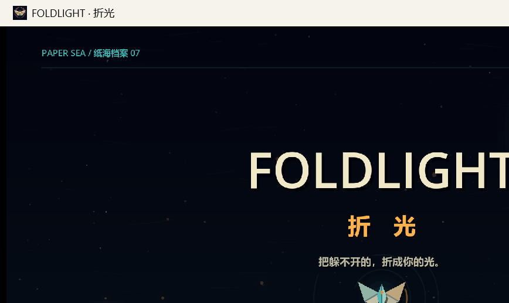

# FOLDLIGHT · 折光

> 一款纸海弹幕肉鸽。收下光，再还回去。



---

## 这是什么

《折光》是一款支持单手键盘与手柄的纸海弹幕游戏。武器自动开火；玩家只需移动、冲刺、展开折域收纳可反射弹幕，并在松开时把光返还给敌人。黑芯金边弹幕不能反射，必须靠走位、冲刺或实体掩体应对。

游戏以**经典战役·十二航**为核心：3 章 × 4 航程 = 12 个独立设计的关卡，从「纸海档案」（第一航·））走到「无名日」（终章）。每航程结束解锁 1 件折光教义（共 19 件），可永久调整后续航程的玩法。

源代码用 Godot 4.6 编写，100% 程序化矢量绘制（无运行时贴图）。

---

## 版本

| 版本 | | 状态 | | 说明 |
|---|---|---|---|---|
| **2.0** | | ✅ 经典战役·十二航完整版 | | 三个核心脚本：游戏核心 + 主角 + HUD。关卡 12 航程 + 教义 19 件。`release/FOLDLIGHT_2.0.exe` 是这个版本的预编译二进制。 |
| **3.9.0** | | ⚠️ 实验性扩展 | | 在 2.0 基础上叠加了肉鸽迷航（22 房间 / 36 强化 / 6 武器）、无尽生存（折光三角洲 6144×4096）、像素 Demo 与教学。三套内容混合被认为是割裂设计，**仅供 fork 实验**，不推荐作为发布基线。 |

**对大多数 fork 用户**：建议以 **2.0** 为基准做你的实验。需要完整游戏性请从 3.9.0 提取并裁剪。

---

## 快速运行

### 直接玩（推荐新手）

下载 `release/FOLDLIGHT_2.0.exe`（≈106 MB），双击即可。Windows 10/11。

### 自己构建

源码在 `foldlight/` 子目录。Godot 4.6.3：

```powershell
& 'G:\path\to\Godot_v4.6.3-stable_win64.exe' --path 'H:\path\to\foldlight_release\foldlight'
```

项目根有 `project.godot`，主场景为 `foldlight/scenes/main.tscn`。导出配置：`foldlight/export_presets.cfg`（含 Windows Desktop preset）。

---

## 操作

| 动作 | | 键盘 | | 手柄 |
|---|---|---|---|---|
| 移动 | | WASD / 方向键 | | 左摇杆 / 十字键 |
| 折域：按住收纳 / 松开返光 | | 空格（也支持 E） | | A |
| 冲刺 | | Shift | | B |
| 主动道具 | | Q | | X |
| 暂停 | | Esc | | Start |

首次进入建议选择「开始序章」；五个短步骤会在真实战斗房间中教授移动、冲刺、折域、主动道具与完整遭遇。

---

## 项目结构

```
foldlight/
├── assets/             # 品牌图标与导入元数据（运行时无贴图）
├── docs/               # 设计文档与计划（foldlight_design / endless_survival / ...）
├── scenes/             # 3 个 .tscn（main / player / hud）
├── scripts/             # 14 个核心脚本（game / player / hud / ...）
├── resources/          # 12 个航程 .tres + 19 个教义 .tres
├── tests/              # 集成测试
├── tools/              # 辅助脚本
├── export_presets.cfg
├── project.godot
├── README.md           # 3.9.0 完整说明（机械敌人 / 无尽 / 像素 Demo 等）
└── ...
```

---

## 美术与设计

- **美术**：深靛纸海 + 暖象牙折纸 + 克制的青金光。玩家是纸翼飞蛾，敌人是紫红花瓣，HUD 是金色。
- **核心循环**：移动闪避 → 按住折域收纳敌弹 → 松开折返为制导返航 → 命中击杀可沿可达路径接力一次（日链）。
- **设计文档**：`foldlight/docs/godot-prompter/specs/`（`foldlight_design.md` / `endless_survival.md` / `chapter_one_campaign.md` 等）。

更多细节见 [`foldlight/README.md`](foldlight/README.md)。

---

## 贡献

- 主要面向 **2.0 经典战役** 做扩展（保持原作节奏与手感）。
- 3.9.0 的肉鸽/无尽部分被认为「两个游戏的割裂」，欢迎重构重写，但请新建分支不要直接动主分支。
- 提 PR 时附带测试用例（`foldlight/tests/integration/`）。

---

## 截图

| | |
|---|---|
|  | 标题画面：`PAPER SEA / 纸海档案 07` + 青金双拼标题 + 纸翼飞蛾图样 |

---

## 协议

MIT。详见 `LICENSE`。